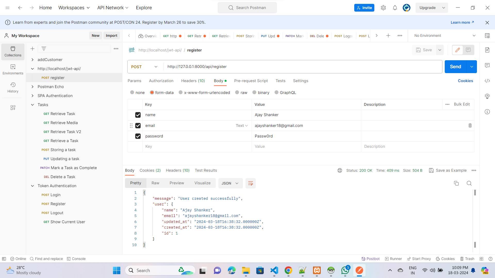
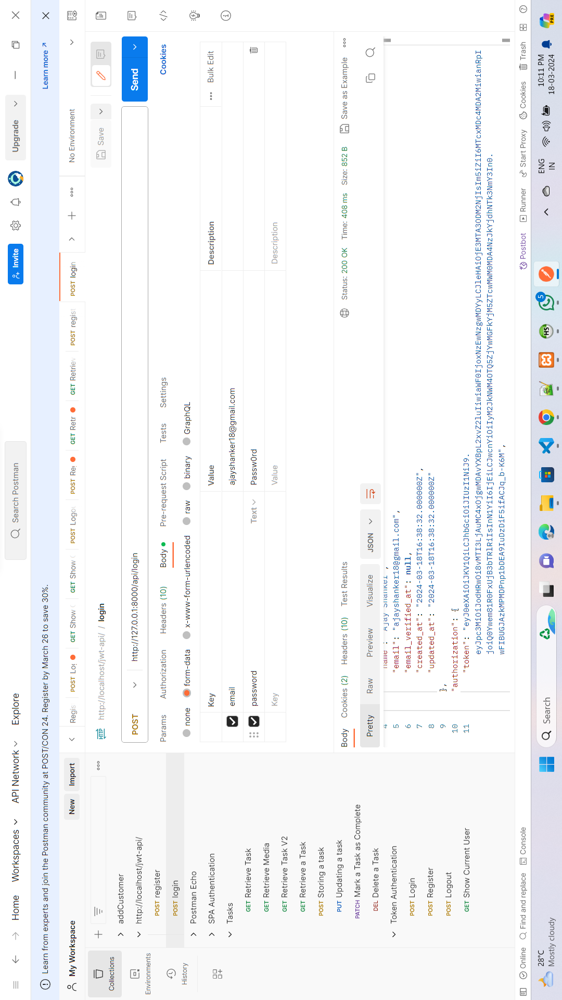

REST API with Laravel 10 using JWT Token

<h5>Step 1: Install Laravel 10</h5> 
`composer create-project laravel/laravel example-app'

<h5>Step 2: Connect Database</h5> 
I am going to use the MYSQL database for this jwt auth laravel 10. So connect the database by updating.env like this: 
DB_CONNECTION=mysql
DB_HOST=127.0.0.1
DB_PORT=3306
DB_DATABASE=YOUR_DB_NAME
DB_USERNAME=YOUR_DB_USERNAME
DB_PASSWORD=YOUR_DB_PASSWORD

<h5>Step 3: Install JWT</h5> 
`composer require php-open-source-saver/jwt-auth'  
<h6>And now publish the configuration file by running this command:</h6> 
`php artisan vendor:publish --provider="PHPOpenSourceSaver\JWTAuth\Providers\LaravelServiceProvider"`  
<h6>Now run the below command to generate JWT secret key like:</h6> 
`php artisan jwt:secret`  
Note: This command will update your .env file like this: JWT_SECRET and JWT_ALGO=HS256

<h5>Step 4: Confuring API Guard</h5> 
<h6>Open file >> config/auth.php</h6>  
    `<?php

return [

    /*
    |--------------------------------------------------------------------------
    | Authentication Defaults
    |--------------------------------------------------------------------------
    |
    | This option controls the default authentication "guard" and password
    | reset options for your application. You may change these defaults
    | as required, but they're a perfect start for most applications.
    |
    */

    'defaults' => [
        'guard' => 'api',
        'passwords' => 'users',
    ],

    /*
    |--------------------------------------------------------------------------
    | Authentication Guards
    |--------------------------------------------------------------------------
    |
    | Next, you may define every authentication guard for your application.
    | Of course, a great default configuration has been defined for you
    | here which uses session storage and the Eloquent user provider.
    |
    | All authentication drivers have a user provider. This defines how the
    | users are actually retrieved out of your database or other storage
    | mechanisms used by this application to persist your user's data.
    |
    | Supported: "session"
    |
    */

    'guards' => [
        'web' => [
            'driver' => 'session',
            'provider' => 'users',
        ],

        'api' => [
            'driver' => 'jwt',
            'provider' => 'users',
        ],
    ],

    /*
    |--------------------------------------------------------------------------
    | User Providers
    |--------------------------------------------------------------------------
    |
    | All authentication drivers have a user provider. This defines how the
    | users are actually retrieved out of your database or other storage
    | mechanisms used by this application to persist your user's data.
    |
    | If you have multiple user tables or models you may configure multiple
    | sources which represent each model / table. These sources may then
    | be assigned to any extra authentication guards you have defined.
    |
    | Supported: "database", "eloquent"
    |
    */

    'providers' => [
        'users' => [
            'driver' => 'eloquent',
            'model' => App\Models\User::class,
        ],

        // 'users' => [
        //     'driver' => 'database',
        //     'table' => 'users',
        // ],
    ],

    /*
    |--------------------------------------------------------------------------
    | Resetting Passwords
    |--------------------------------------------------------------------------
    |
    | You may specify multiple password reset configurations if you have more
    | than one user table or model in the application and you want to have
    | separate password reset settings based on the specific user types.
    |
    | The expiry time is the number of minutes that each reset token will be
    | considered valid. This security feature keeps tokens short-lived so
    | they have less time to be guessed. You may change this as needed.
    |
    | The throttle setting is the number of seconds a user must wait before
    | generating more password reset tokens. This prevents the user from
    | quickly generating a very large amount of password reset tokens.
    |
    */

    'passwords' => [
        'users' => [
            'provider' => 'users',
            'table' => 'password_reset_tokens',
            'expire' => 60,
            'throttle' => 60,
        ],
    ],

    /*
    |--------------------------------------------------------------------------
    | Password Confirmation Timeout
    |--------------------------------------------------------------------------
    |
    | Here you may define the amount of seconds before a password confirmation
    | times out and the user is prompted to re-enter their password via the
    | confirmation screen. By default, the timeout lasts for three hours.
    |
    */

    'password_timeout' => 10800,

];
`

<h5>Step 5: Update User Model   app\Models\User.php</h5> 
`<?php

namespace App\Models;

use Laravel\Sanctum\HasApiTokens;
use Illuminate\Notifications\Notifiable;
use Illuminate\Contracts\Auth\MustVerifyEmail;
use PHPOpenSourceSaver\JWTAuth\Contracts\JWTSubject;
use Illuminate\Database\Eloquent\Factories\HasFactory;
use Illuminate\Foundation\Auth\User as Authenticatable;

class User extends Authenticatable implements JWTSubject
{
    use HasApiTokens, HasFactory, Notifiable;

    /**
     * The attributes that are mass assignable.
     *
     * @var array<int, string>
     */
    protected $fillable = [
        'name',
        'email',
        'password',
    ];

    /**
     * The attributes that should be hidden for serialization.
     *
     * @var array<int, string>
     */
    protected $hidden = [
        'password',
        'remember_token',
    ];

    /**
     * The attributes that should be cast.
     *
     * @var array<string, string>
     */
    protected $casts = [
        'email_verified_at' => 'datetime',
    ];

    /**
     * Get the identifier that will be stored in the subject claim of the JWT.
     *
     * @return mixed
     */
    public function getJWTIdentifier()
    {
        return $this->getKey();
    }

    /**
     * Return a key value array, containing any custom claims to be added to the JWT.
     *
     * @return array
     */
    public function getJWTCustomClaims()
    {
        return [];
    }
} '

<h5>Step 6: Create Route  routes/api.php</h5> 
`<?php

use Illuminate\Support\Facades\Route;
use App\Http\Controllers\API\AuthController;

Route::controller(AuthController::class)->group(function () {
    Route::post('login', 'login');
    Route::post('register', 'register');
    Route::post('logout', 'logout');
    Route::post('refresh', 'refresh');
});'

<h5>Step 7: Create Controller</h5> 
`php artisan make:controller API/AuthController'

 <h6>app/Http/Controllers/API/AuthController.php update this file</h6> 
`<?php

namespace App\Http\Controllers\API;

use App\Models\User;
use Illuminate\Http\Request;
use App\Http\Controllers\Controller;
use Illuminate\Support\Facades\Auth;
use Illuminate\Support\Facades\Hash;

class AuthController extends Controller
{
    public function __construct()
    {
        $this->middleware('auth:api', ['except' => ['login', 'register']]);
    }

    public function login(Request $request)
    {
        $request->validate([
            'email' => 'required|string|email',
            'password' => 'required|string',
        ]);
        $credentials = $request->only('email', 'password');
        $token = Auth::attempt($credentials);
        
        if (!$token) {
            return response()->json([
                'message' => 'Unauthorized',
            ], 401);
        }

        $user = Auth::user();
        return response()->json([
            'user' => $user,
            'authorization' => [
                'token' => $token,
                'type' => 'bearer',
            ]
        ]);
    }

    public function register(Request $request)
    {
        $request->validate([
            'name' => 'required|string|max:255',
            'email' => 'required|string|email|max:255|unique:users',
            'password' => 'required|string|min:6',
        ]);

        $user = User::create([
            'name' => $request->name,
            'email' => $request->email,
            'password' => Hash::make($request->password),
        ]);

        return response()->json([
            'message' => 'User created successfully',
            'user' => $user
        ]);
    }

    public function logout()
    {
        Auth::logout();
        return response()->json([
            'message' => 'Successfully logged out',
        ]);
    }

    public function refresh()
    {
        return response()->json([
            'user' => Auth::user(),
            'authorisation' => [
                'token' => Auth::refresh(),
                'type' => 'bearer',
            ]
        ]);
    }
}`

<h5>Step 7: Create Controller</h5> 
`php artisan migrate` 
Now if you start your server by running php artisan serve and test all API via Postman like this:
REGISTER API
http://127.0.0.1:8000/api/register  
http://127.0.0.1:8000/api/login 
http://127.0.0.1:8000/api/ 
and REFRESH TOKEN 
http://127.0.0.1:8000/api/refresh

### Premium Partners

**
**
